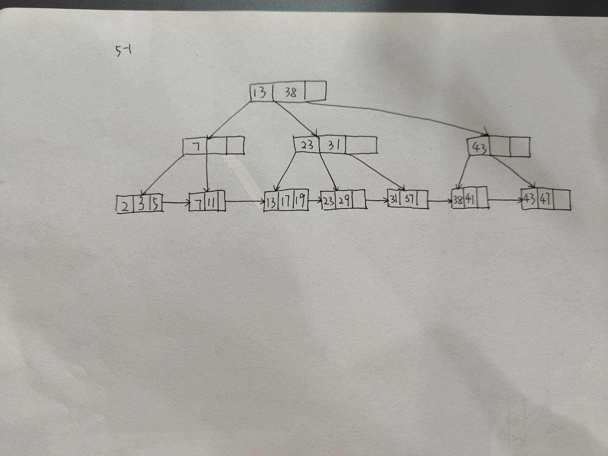
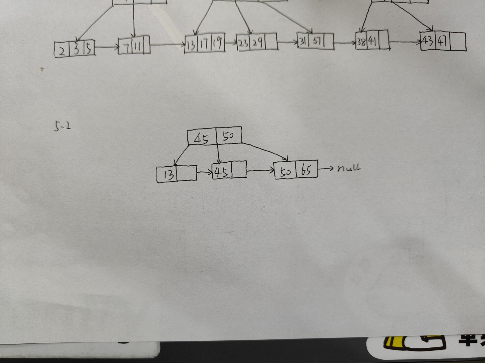
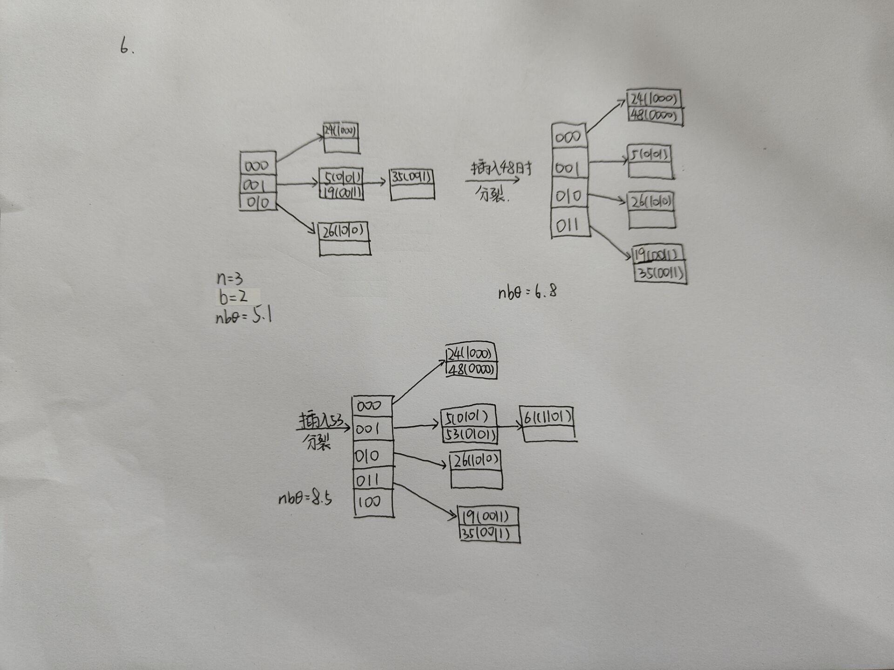
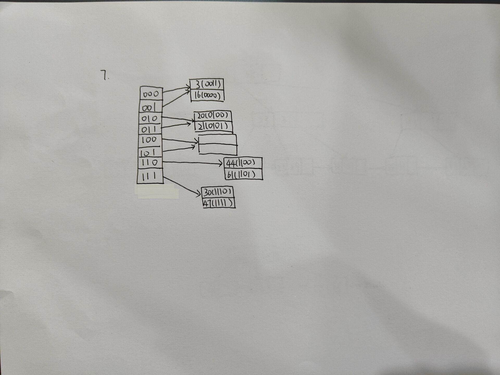

# 作业2

学号：7203610316
姓名：符兴
班级：20W0312

第一题

**Solution:**

1.$(AB)^+_F=\text{\{A,B,C,D,E\}}$
分解函数依赖得$\{\text{AB}\rightarrow \text{C},
\text{BC}\rightarrow \text{A},
\text{BC}\rightarrow \text{D},
\text{D}\rightarrow \text{E},
\text{CF}\rightarrow \text{B},
\text{AB}\rightarrow \text{D}\}$；

删除冗余函数依赖得$\{\text{AB}\rightarrow \text{C},
\text{BC}\rightarrow \text{A},
\text{BC}\rightarrow \text{D},
\text{D}\rightarrow \text{E},
\text{CF}\rightarrow \text{B}\}$
    
3.R的候选码为ABF、CF；
4.{ABC}、{BCD}、{DE}、{BCF}、{ABF}

---

第二题

**Solution：**

1.$\{\text{B}\rightarrow \text{C},
\text{B}\rightarrow \text{E},
\text{C}\rightarrow \text{B},
\text{AB}\rightarrow \text{D},
\text{E}\rightarrow \text{F}\}$

2.R的全部候选键：AB、AC

---

第三题

**Solution：**

1.R的函数依赖集：$\{\text{A}\rightarrow \text{B},
\text{A}\rightarrow \text{C},
\text{BC}\rightarrow \text{D},
\text{BC}\rightarrow \text{E},
\text{D}\rightarrow \text{E},
\text{E}\rightarrow \text{G}\}$

候选码：A

2.R中每个属性不可分，且每个非主属性都完全函数依赖于R的候选码，但是存在传递依赖，所以R不符合第三范式。

---

第四题

**Solution：**

1.函数依赖集$\text{F} = \{
\text{\{CNo,PNo\}}\rightarrow \text{\{STime, ETime\}},
\text{\{PNo\}}\rightarrow \text{\{PAddr\}},
\text{\{PNo\}}\rightarrow \text{\{Rent\}},
\text{\{PNo\}}\rightarrow \text{\{ONo\}},
\text{\{ONo\}}\rightarrow \text{\{OPhone\}},
\text{\{OPhone\}}\rightarrow \text{\{ONo\}}
\}$

极小函数依赖集$\text{F}_m = \{
\text{\{CNo,PNo\}}\rightarrow \text{\{STime\}},
\text{\{CNo,PNo\}}\rightarrow \text{\{ETime\}},
\text{\{PNo\}}\rightarrow \text{\{PAddr\}},
\text{\{PNo\}}\rightarrow \text{\{Rent\}},
\text{\{PNo\}}\rightarrow \text{\{ONo\}},
\text{\{ONo\}}\rightarrow \text{\{OPhone\}},
\text{\{OPhone\}}\rightarrow \text{\{ONo\}}
\}$

2.其候选码为CNo PNo；每个属性不可分，且每个非主属性都完全函数依赖于R的候选码，但是存在传递依赖关系$\text{PNo}\rightarrow \text{ONo},\text{ONo}\rightarrow \text{OPhone}$；故最高的范式等级为2NF。

3.$\text{\{CNo,PNo,STime\}\{CNo,PNo,ETime\}\{PNo,PAddr\}}$
$\text{\{PNo,Rent\}\{PNo,ONo\}\{ONo,OPhone\}}$

---

第五题

(1)

Solution：

(2)

Solution:

---

第六题

**Solution:**

---

第七题

**Solution:**

