# 实验 1

## 系统环境

- OS: Windows 11
- SQL: MySQL 8.0

## 实验内容

### 创建数据库

```sql
create database company;
```

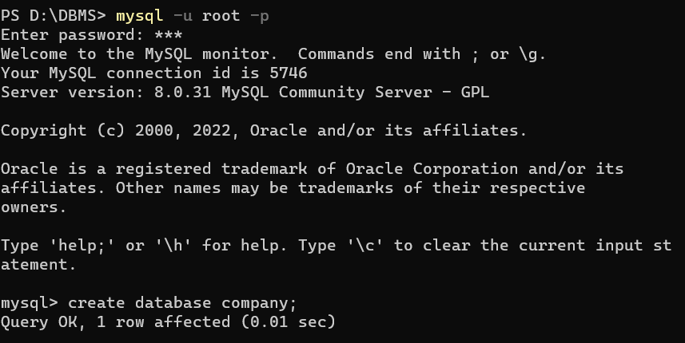

### 创建表

```sql
use company;
create table employee (
    ename varchar(12),
    essn char(18),
    address text,
    salary int,
    superssn char(18),
    dno char(3),
    primary key(essn)
);

create table department (
    dname varchar(5),
    dno char(3),
    mgrssn char(18),
    mgrstartdate date,
    primary key(dno)
);

create table project (
    pname varchar(3),
    pno char(2),
    plocation text,
    dno char(3),
    primary key(pno)
);

create table works_on (
    essn char(18),
    pno char(2),
    hours int,
    primary key(essn, pno)
);
```

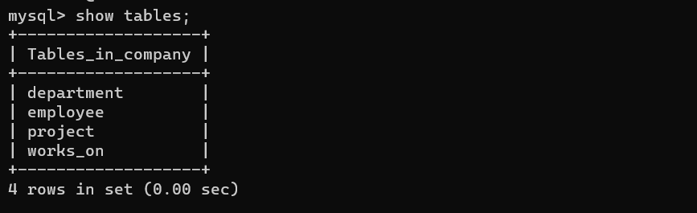


### 导入数据

```sql
load data local infile "employee.txt" into table employee;
load data local infile "department.txt" into table department;
load data local infile "project.txt" into table project;
load data local infile "works_on.txt" into table works_on;
```

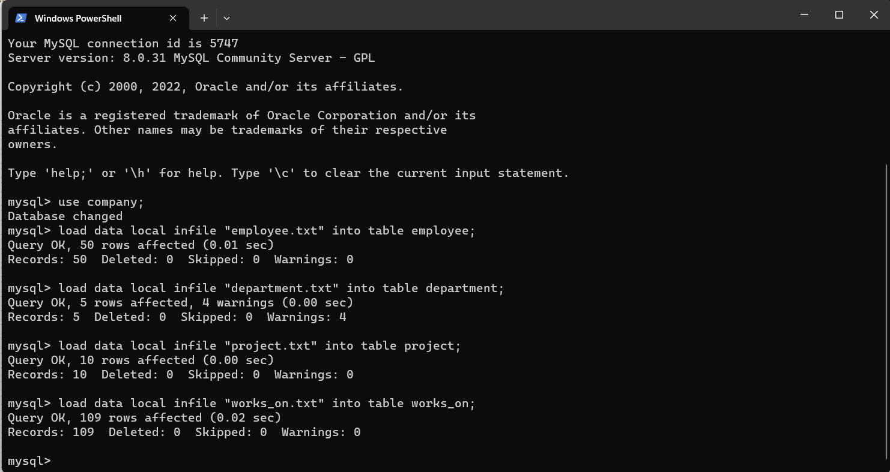

### 实验任务

#### 任务 1

参加了项目名为“SQL Project”的员工名字
- ENAME 在 employee 中；PNAME 在 project 中
- 每个员工只属于一个部门；员工可以参加其他部门的项目
- 参加项目的员工的工作时间>0；工作时间=0的没参加项目

```sql
select ename from employee
where essn in (
    select essn from project, works_on
    where project.pno=works_on.pno 
    and pname="SQL" and hours>0
);
```

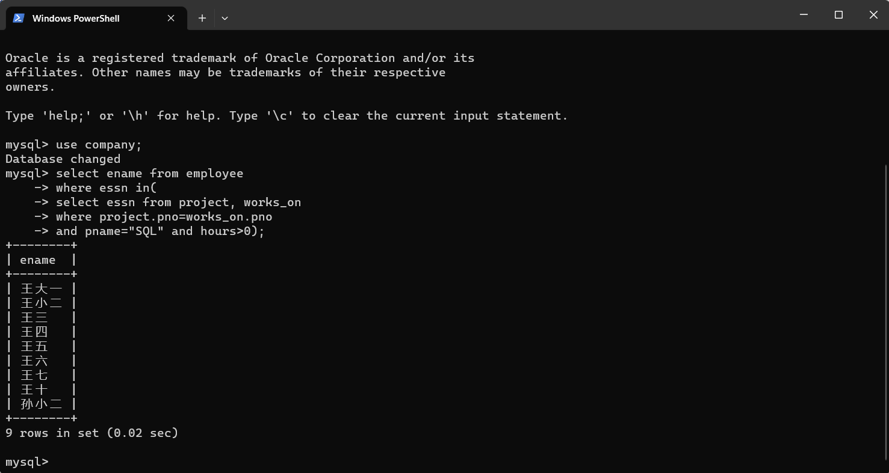

#### 任务 2

在“研发部”工作且工资低于3000元的员工名字和地址
- DNAME 在 department 中；SALARY/ENAME/ADDRESS 在 employee 中

```sql
select ename, address from employee, department
where employee.dno=department.dno 
and dname="研发部" and salary<3000;
```

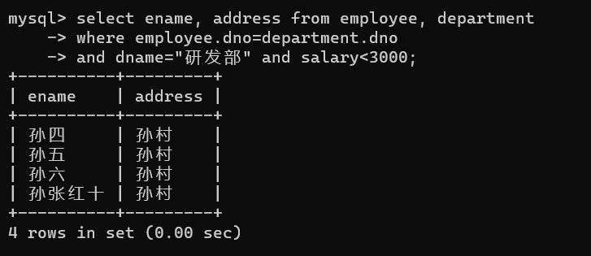

#### 任务 3

没有参加项目编号为P1的项目的员工姓名
- PNO 在 works_on 中；ENAME 在 employee 中
- 没有参加项目编号 P1 的员工 NOT IN 参加了项目 P1 的员工
- 参加项目的员工的工作时间>0；工作时间=0的没参加项目
- 用主键索引数据记录

```sql
select ename from employee
where essn not in (
    select essn from works_on
    where pno="P1" and hours>0);
```

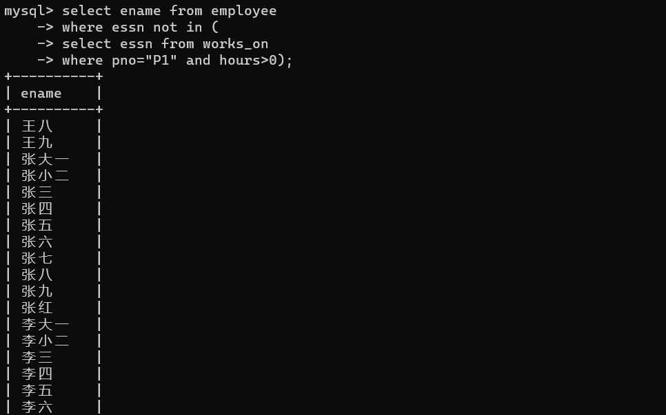

运行结果：有41名员工

#### 任务 4

由张红领导的工作人员的姓名和所在部门的名字
- ENAME 在 employee 中；DNAME 在 department 中
- 用主键索引数据记录

```sql
select ename, dname from employee, department
where employee.dno=department.dno
and superssn in (
select essn
    from employee
    where ename="张红");
```

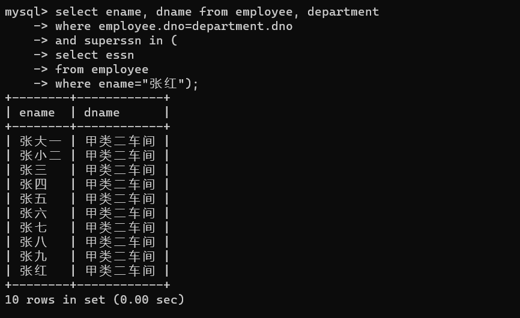

#### 任务 5

至少参加了项目编号为P1和P2的项目的员工号
- PNO/ESSN 在 works_on 中
- 参加项目的员工的工作时间>0；工作时间=0的没参加项目
- DISTINCT 去掉重复记录
- “至少参加……”等价于“既参加……又参加……”
- 第二种方法要注意列名模糊不清

```sql
select essn from works_on
where pno="P1" and hours>0 and essn in (
    select essn from works_on 
    where pno="P2" and hours>0);
```

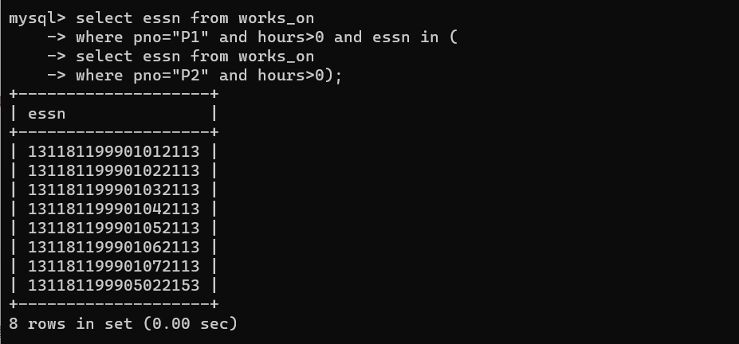

#### 任务 6

参加了全部项目的员工号码和姓名
- ESSN 在 works_on 中；ENAME 在 employee 中
- “参加全部项目”等价于“不存在有一个项目该员工没参加”
- “参加全部项目”等价于“该员工参加的项目为项目总数”

```sql
select essn, ename from employee
where not exists (
    select pno from project
    where not exists (
        select * from works_on
        where works_on.pno=project.pno
        and works_on.essn=employee.essn));
```

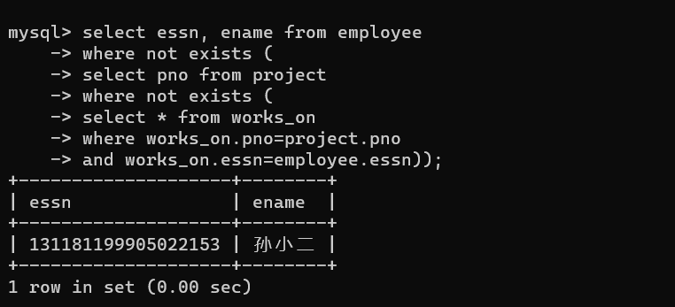

#### 任务 7

员工平均工资低于3000元的部门名称
- SALARY 在 employee 中；DNAME 在 department 中

```sql
select dname from department
where dno in (
    select dno from employee
    group by dno having avg(salary)<3000);
```

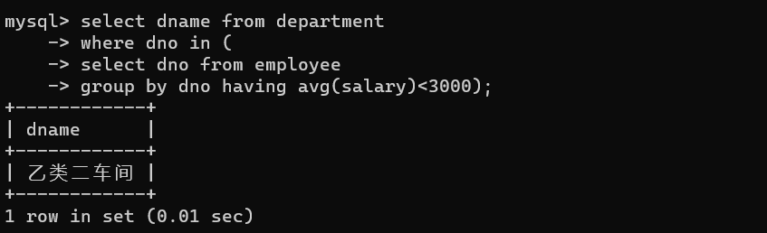

#### 任务 8

至少参与了3个项目且工作总时间不超过8小时的员工名字
- PNO/HOURS 在 works_on 中；ENAME 在 employee 中

```sql
select ename from employee
where essn in (
    select essn from works_on
    group by essn having count(pno)>=3
    and sum(hours)<=8);
```

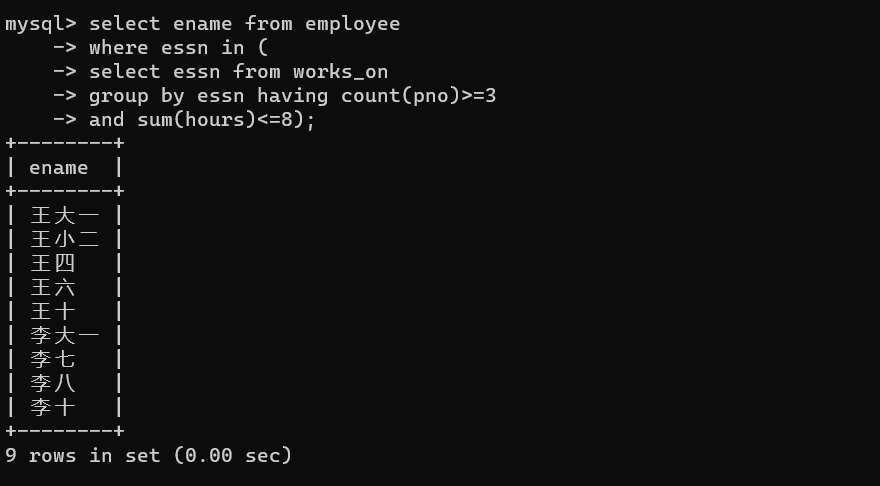

#### 任务 9

每个部门的员工小时平均工资

- HOURS 在 works_on 中；DNO/SALARY 在 employee 中
- 每个部门的员工小时平均工资=部门总工资÷部门总工作时长
- 注意临时表的使用
- 注意列名模糊不清

```sql
select sums.dno, sumsalary/sumhours as hoursavgsalary
from (
    select dno, sum(salary) as sumsalary
    from employee group by dno
) as sums, (
    select dno, sum(hours) as sumhours
    from works_on join employee
    on works_on.essn = employee.essn
    group by dno
) as sumh
where sums.dno=sumh.dno;
```

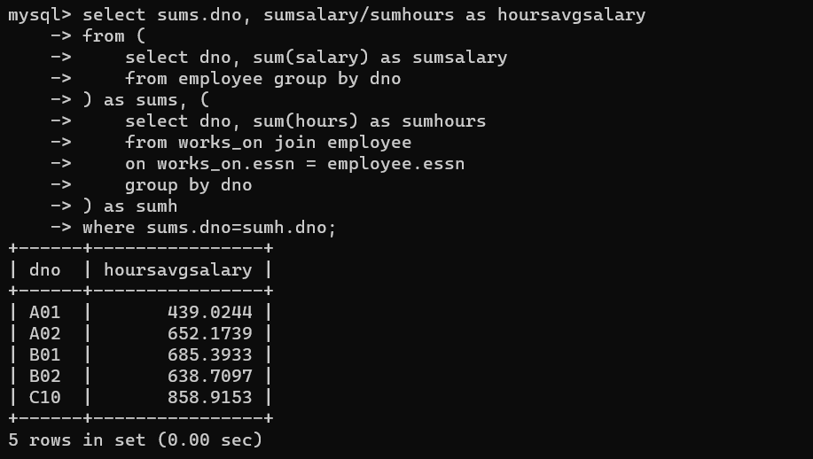

### 任务10
查询所有干过非自己部门任务的员工的姓名和小时平均工资。

```sql
select ename, avgsalary from 
(select ename, salary/sum(hours) as avgsalary, dno, employee.essn
 from works_on join employee on works_on.essn = employee.essn
 group by employee.essn) as tmp_employee
where exists(
    select pno from works_on 
    where works_on.essn = tmp_employee.essn and pno not in (select pno from project where project.dno = tmp_employee.dno)
);
```
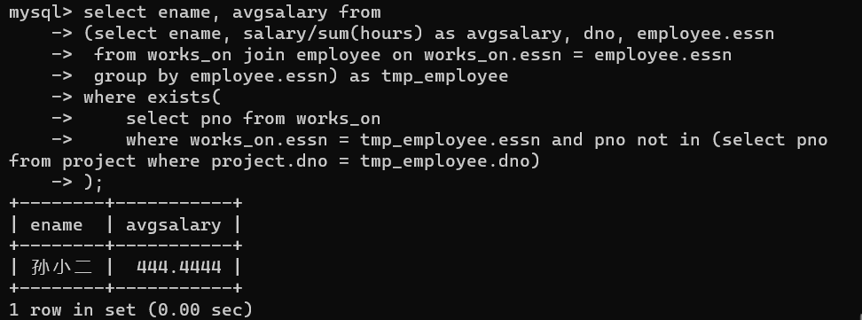

### 任务11
查询小时平均工资超过1000的员工姓名和小时平均工资

```sql
select * from 
(select ename, salary/sum(hours) as avgsalary
 from works_on join employee on works_on.essn = employee.essn
 group by employee.essn) as tmp_employee
where avgsalary > 1000;
```

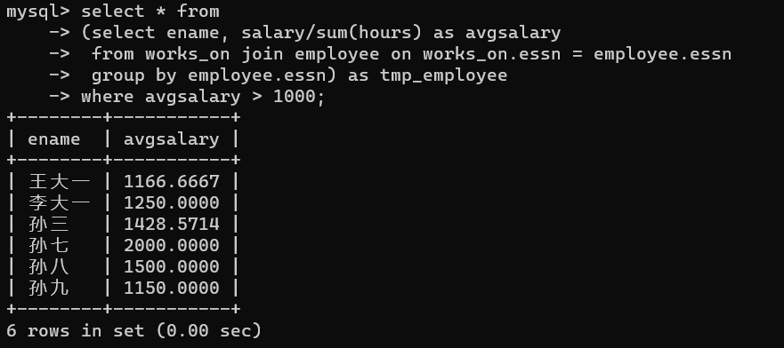